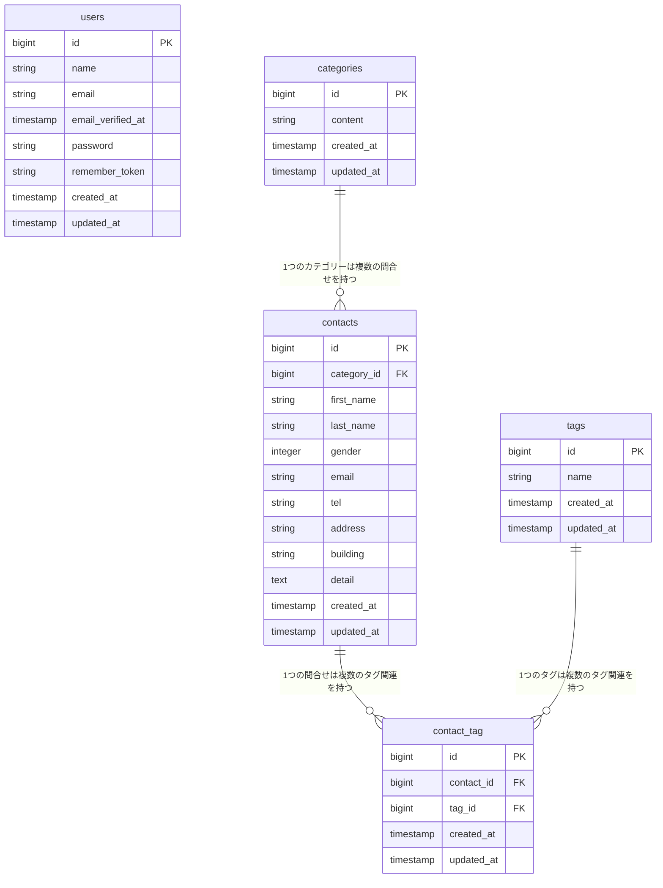

# coachtech お問い合わせフォーム

## 概要
COACHTECH 「基礎学習ターム 確認テスト_お問い合わせフォーム」で作成した成果物です。
一般ユーザーが利用する公開のお問い合わせフォームで、誰でもお問い合わせを送信でき、管理者はログイン後にその内容を確認・管理できる仕様です。
### 実装した機能
- マイグレーション・モデル作成とリレーション定義
- 認証機能（Fortify）
- 問合せ・タグのCRUD機能
- 検索機能

## ER図


## 環境構築手順
### 1.リポジトリのクローン
```bash
git clone https://github.com/hakua411/contact-form-app.git
```
### 2.Laravelプロジェクトの作成 (Laravel 10.x)
Laravel 10.x を指定してプロジェクトを作成
```bash
docker run --rm \
    -u "$(id -u):$(id -g)" \
    -v "$(pwd):/var/www/html" \
    -w /var/www/html \
    -e COMPOSER_CACHE_DIR=/tmp/composer_cache \
    laravelsail/php82-composer:latest \
    composer create-project laravel/laravel:^10.0 contact-form-app
```
### 3.Laravel Sailのインストール
プロジェクトディレクトリに移動
```bash
cd contact-form-app
```
Laravel Sailをインストール
```bash
docker run --rm \
    -u "$(id -u):$(id -g)" \
    -v "$(pwd):/var/www/html" \
    -w /var/www/html \
    -e COMPOSER_CACHE_DIR=/tmp/composer_cache \
    laravelsail/php82-composer:latest \
    composer require laravel/sail --dev
```
Sailの設定ファイルをパブリッシュ（MySQLを選択）
```bash
docker run --rm \
    -u "$(id -u):$(id -g)" \
    -v "$(pwd):/var/www/html" \
    -w /var/www/html \
    -e COMPOSER_CACHE_DIR=/tmp/composer_cache \
    laravelsail/php82-composer:latest \
    php artisan sail:install --with=mysql
```
### 4. .env ファイルの設定
.env ファイルを開き、データベース接続情報が以下と一致していることを確認します。

- DB_CONNECTION=mysql
- DB_HOST=mysql
- DB_PORT=3306
- DB_DATABASE=laravel
- DB_USERNAME=sail
- DB_PASSWORD=password

DB_HOST は localhost や 127.0.0.1 ではなく、Dockerコンテナ名である mysql を指定します。
### 5.フロントエンドのセットアップ (Vite & Tailwind CSS)
1. NPM依存パッケージのインストール
sail npm install を実行する前に、必ずSailコンテナが起動していることを確認してください。
```bash
sail npm install
```
2. Tailwind CSSのインストール
```bash
sail npm install -D tailwindcss@^3.4.0 postcss autoprefixer
sail npm install alpinejs
```
3. 設定ファイルの生成
```bash
sail npx tailwindcss init -p
```
4. Tailwind CSSのテンプレートパス設定
tailwind.config.js を開き、以下のように設定します。
```bash
/** @type {import("tailwindcss").Config} */
export default {
  content: [
    "./resources/**/*.blade.php",
    "./resources/**/*.js",
    "./resources/**/*.vue",
  ],
  theme: {
    extend: {},
  },
  plugins: [],
}
```
5. 提供リポジトリのresourcesディレクトリと入れ替え
以下のリポジトリをクローンし、resourcesディレクトリを丸ごと入れ替えます。
```bash
git clone https://github.com/coachtech-prepared-file/Preparedblade-ConfirmationTest-ContactForm.git
```
入れ替え手順:
① Finderでプロジェクトフォルダを開きます。
open .
② プロジェクト内の resources フォルダを削除します。
③ クローンしたリポジトリ内の resources フォルダをプロジェクト直下にコピーします。

※コマンド操作に慣れている場合は rm -rf と cp -r でも可能ですが、誤削除を防ぐためFinderでの操作を推奨します。

6. Vite開発サーバーの起動
```bash
sail npm run dev
```
注意: sail npm run dev は実行したままにしておく必要があります。
